# Proyecto de Base de Datos

### Instalación

1. Abre un terminal en una carpeta donde quieras ubicar el proyecto y clona el repositorio:

    ```sh
    git clone https://github.com/Vdiaz127/farmacia_bd.git
    ```

2. Instala un entorno virtual:

    ```sh
    python -m venv venv
    ```

3. Activa el entorno virtual:

    ```sh
    venv/Scripts/activate  # Windows
    ```

    *El entorno virtual es opcional, úsalo si no quieres instalar tantas dependencias en tu Python.*
    <br>
4. Entra o ubícate dentro del directorio del proyecto.

    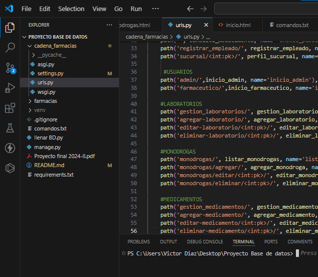
    *Visualiza dónde está ubicado el terminal.*
    <br>
5. Instala las dependencias:

    ```sh
    pip install -r requirements.txt
    ```

    
    <br>
### Configuración/conexión a la base de datos

1. Para la configuración de la base de datos, abre el archivo `settings.py`.

    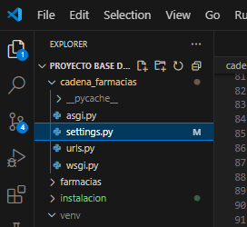
    <br>
2. Busca el apartado de configuración de la base de datos.

    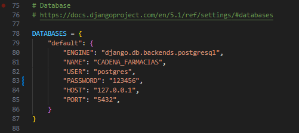

    La variable `ENGINE` no se debe tocar. El resto de los campos deben configurarse acorde a cómo se instaló PostgreSQL en la PC donde se ejecutará 
    
    ***NOTA: El `NAME` debe coincidir 100% con una base de datos que se haya creado desde cero (sin nada) en PostgreSQL.***
    <br>
    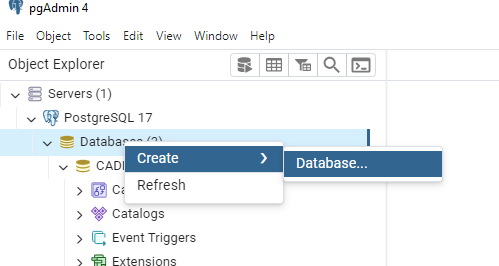<br>
    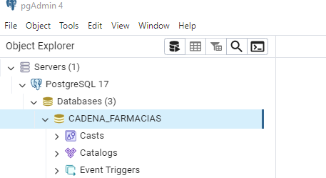<br>

### Migración de la base de datos

El proceso de migración consiste en pasar las tablas definidas en el proyecto a la base de datos local o la que se haya elegido.

1. Ejecuta la primera fase de migración:

    ```sh
    python manage.py makemigrations farmacias
    ```

    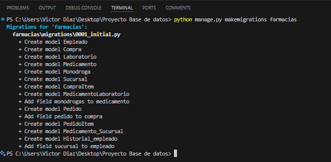
    <br>
2. Ejecuta la segunda fase de migración:

    ```sh
    python manage.py migrate
    ```

    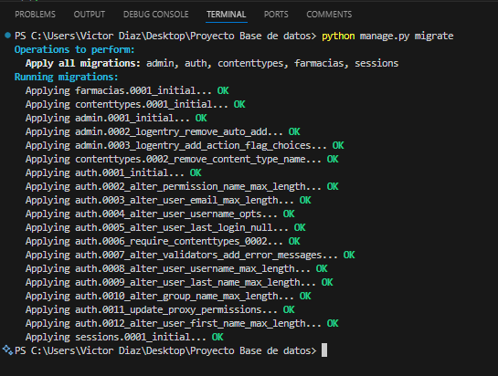
    <br>
    Ya en este punto, puedes revisar en tu PostgreSQL las tablas con las que operará el sitio web. Las tablas se ubican en pgAdmin buscando: `Base de datos > Schemas > Public > Tables`.

    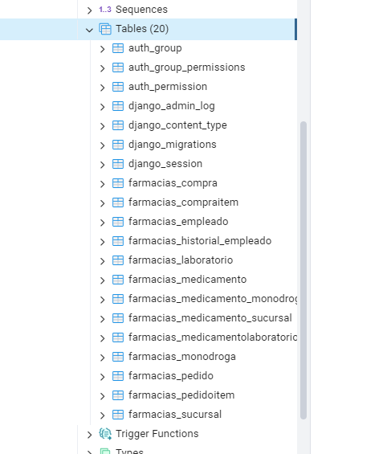
    <br>
### Llenado de la base de datos

Para manipular el sitio web, se debe entrar con un usuario. No hay usuarios registrados por defecto al hacer una migración, pero se hizo un script para ingresar datos al sistema.

1. Revisa el script para ver los datos de los usuarios que se ingresarán al sistema (correo, contraseña, nombre...).

2. Para llenar la base de datos con datos, usa el script `llenar_BD.py`:

    ```sh
    python llenar_BD.py
    ```

    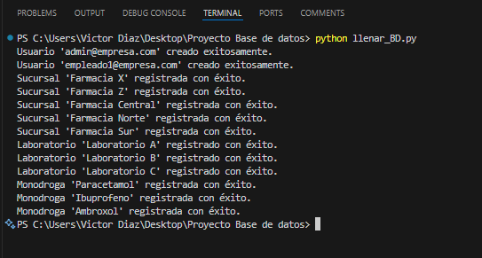
    <br>
    **SI ESTÁS USANDO VISUAL STUDIO CODE:** También puedes hacer clic en este botón que aparece al abrir el archivo `.py`.
    <br>
    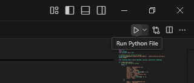

### Ejecución del proyecto

Para ejecutar el proyecto, usa el comando:

```sh
python manage.py runserver
```

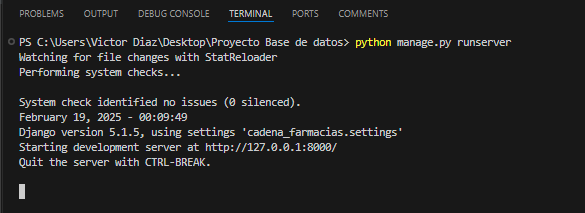
<br>
Ahora solo falta que ingreses al sitio web en tu navegador (http://127.0.0.1:8000/) y verás el proyecto listo para usar.
